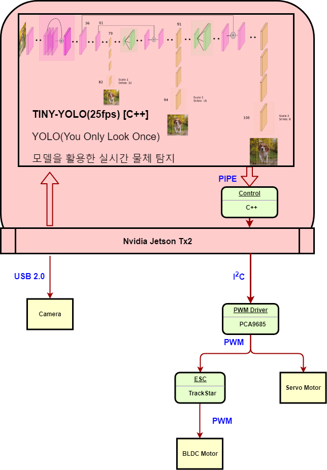
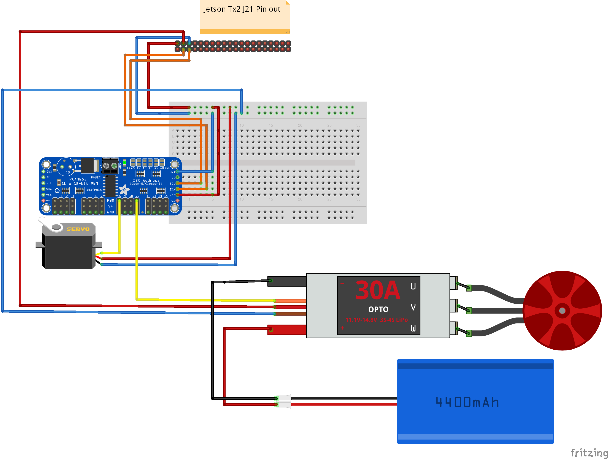

# ProtoType  
YOLO를  통한 Object Detection을 하였고, 이를 모터에 전달하여 제어 하는 모델입니다.  
전체적인 초점은 모터 제어에 맞추어져 있었음으로 YOLO, PCA9685 라이브러리를 사용했습니다.  

# Architecture  
  

# Circuit  
  
 
# Parts  
Car Frame : [SCX10](https://www.aliexpress.com/item/CNC-Aluminum-Metal-and-Carbon-Frame-for-RC-Car-1-10-AXIAL-SCX10-Chassis-313mm-Wheelbase/32831347824.html?spm=a2g0s.9042311.0.0.144a4c4d9jfaQI)  

Main Board : [Jetson-Tx2](http://mdsshop.co.kr/?gclid=Cj0KCQiAgf3gBRDtARIsABgdL3m1lWfbT_0kK4syXVMFdOvAyhu8sAn87FtCkUhsRx3w42Kl15YZgxwaAtKoEALw_wcB)  

PWM Driver : [PCA9685](https://ko.aliexpress.com/item/16-Channel-12-bit-PWM-Driver-I2C-interface-PCA9685-module-pi-shield-module-servo-shield/32833579442.html?spm=a2g0s.9042311.0.0.144a4c4d9jfaQI)  

ESC and BLDC motor : [TRACKSTAR SET](https://hobbyking.com/en_us/trackstar-roar-approved-1-10th-stock-class-brushless-esc-and-motor-combo-17-5t.html)  

Lipo-Battery for ESC : [5600mah 2S2P](https://hobbyking.com/en_us/sales/order/view/order_id/7254682)  

Lipo-Battery pack for Jetson Tx2 : [Not Decided]  

Battery Charger : [IMAX B6 50W 5A](https://hobbyking.com/en_us/imax-b6-50w-5a-charger-discharger-1-6-cells-genuine.html)  

Battery Charger DC Supply : [DC Supply](https://hobbyking.com/en_us/hobbyking-105w-15v-7a-switching-dc-power-supply.html)  

